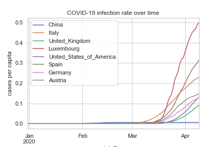
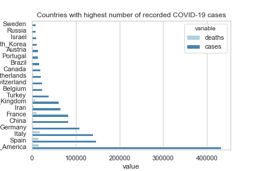
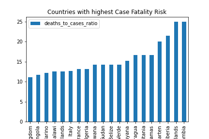

# COVID ML

This project analyses publically available data on the COVID-19 pandemic and identifies trends and patterns using the pandas data analysis framework.

Examples of graphs that are produced:







## Installation
The data runs inside a Jupyter notebook.
Make sure you install the core Jupyter runtime as well as the following libraries:
* pandas - the core data manipulation
* sklearn (optional) - was used for normalisation scaling but no longer needed
* matplotlib - for plotting the data
* xlrd - used by pandas to read the raw data in Excel

All dependencies are stored inside ```requirements.txt``` and can be installed via ```pip```:

```
pip install -r requirements.txt
```

## Usage
To run the notebook in interactive mode, launch it with:

```
jupyter notebook covid.ipynb
```

This will start the Jupyter server and open the notebook in a browser window.
Press the 'h' key to get help on using Jupyter.

To execute the notebook in non-interactive mode (i.e. to just force a download of the latest data and the generation of the graphs), type:

```
jupyter notebook --execute covid.ipynb
```

This will execute the notebook silently and create a ```covid.html``` file as output.
All the graphs will be updated in the graphs folder.
