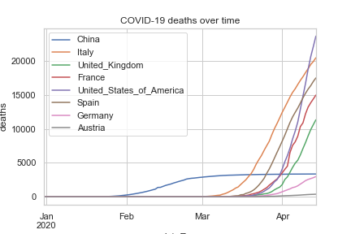

This page only shows key graphs that are generated from the Jupyter notebook.
To view the complete set of graphs and a detailed analysis of the different trends, open [this HTML version of the notebook](covid.html).

To skip directly to the blog posts, you find the full index [here](blog).

Note: the graphs are updated on an hourly basis, but the underlying data files fro the [European Centre for Disease Prevention and Control](https://www.ecdc.europa.eu) are only updated daily (more details [here](https://www.ecdc.europa.eu/en/covid-19/data-collection)).

---

### Key data graphs

This is the latest graph showing worldwide COVID-19 infections and deaths. The worldwide trend does not show any signs of slowing:

This graph shows the new recorded infections for selected countries. Some countries appear to have passed the peak infection rate:

This bar chart summarises the top 20 countries with the most recorded COVID-19 cases. Corresponding deaths are shown as secondary bars (lighter colour):

This graph shows the evolution of COVID-19 related deaths in selected countries over time:

---

### Detailed graphs

A Jupyter notebook includes more detailed graphs on infection rates, mortality rates etc as well as country-specific daily statistics.
* The notebook is stored [here](https://github.com/paulknewton/covid-ml/blob/master/covid.ipynb) (Github will show this as HTML, but it is not updated dynamically)
* A HTML version is updated on an hourly basis [here](https://paulknewton.github.io/covid-ml/covid.html)

---
