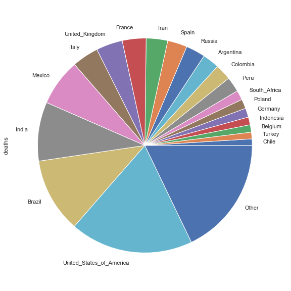

Welcome to the Data Science and COVID-19 project.
This project analyses publicly available data from the [European Centre for Disease Prevention and Control](https://www.ecdc.europa.eu) on the COVID-19 pandemic using Data Science tools and techniques.

The site includes:
* [Data Science and COVID-19 Blog](blog) - discusses trends and patterns regarding the COVID-19 pandemic in terms of infection rates, etc. Also explains how you can use freely available tools to perform your own analysis of COVID data.
The code and supporting scripts are all hosted on the [COVID-ML github repository](https://github.com/paulknewton/covid-ml).
* [COVID-19 Graph Repository](#covid-19-graph-repository) - regularly updated graphs showing different aspects of the COVID-19 virus (infection numbers, mortality rates, Case Infection Risks etc)

---

## Headlines

The number of officially recorded COVID-19 cases is now approaching 4 million and the number of deaths has exceeded 200,000 worldwide.


**Worldwide cases: {{ stat.value }}**


**Worldwide deaths: {{ stat.value }}**


*Data last updated {{ stat.value }}*

---

## COVID-19 Graph Repository

Graphs and analyses relating to the COVID-19 pandemic are organised into categories to simplify navigation:

 | [Graphs showing cumulative statistics: total infections & deaths over time, top 20 hotpots, Case Fatality Risks etc](totals)
 | [Graphs showing the growth of the virus over time and infection/mortality rates](rates)
 | [Country-specific graphs](countries)

---

